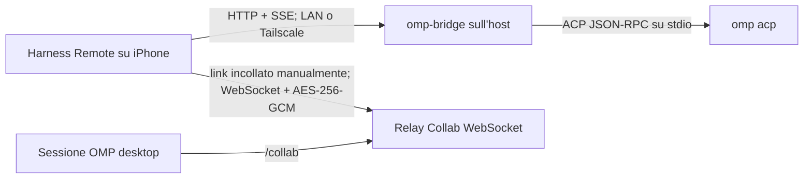

# Piano di integrazione Oh My Pi

## Identità prodotto

**Nome prodotto:** Harness Remote, client web/PWA e iOS-first (React/Vite + Capacitor 8, iOS 15+) per harness remoti.
Il repository e l'app web/PWA supportano i backend OpenCode, OMP, PI e Claude; l'app nativa iOS è invece
intenzionalmente solo OMP, forza questo backend e non mostra il selettore. I nomi dei singoli harness compaiono solo
nei riferimenti ai rispettivi protocolli, comandi e contratti. Il progetto iOS generato vive in `web/ios/` ed è ignorato.

## Decisione

OMP è disponibile con due trasporti distinti. Il percorso diretto usa il bridge locale del repository, che traduce
HTTP/SSE in ACP su stdio tramite `omp acp`. Il percorso Collab, opzionale, collega l'app al relay WebSocket cifrato
avviato da una sessione desktop OMP con `/collab`. Nessuno dei due percorsi legge il database OMP, ispeziona processi
OMP esistenti o tenta una discovery globale delle sessioni.



Nell'app web/PWA l'utente può selezionare il backend; nell'app nativa iOS il backend è forzato a OMP e il selettore è
nascosto. OMP diretto usa il bridge, mentre OMP Collab richiede il link bearer creato nella sessione desktop interessata
e incollato con **Attach OMP Collab**. Tailscale fornisce soltanto il routing tra i dispositivi ed è installato e
autenticato a parte.

## Architettura

### App

1. `BackendKind = "opencode" | "omp" | "pi" | "claude"` descrive i backend del repository e dell'app web/PWA; il
   contenitore nativo iOS forza `"omp"` e nasconde la selezione.
2. `RemoteAdapter` espone salute, sessioni, prompt, annullamento ed eventi comuni.
3. `OpenCodeAdapter` mantiene gli endpoint esistenti; l'adapter OMP diretto usa HTTP/SSE e quello Collab WebSocket.
4. Le capacità dichiarate nascondono i controlli non disponibili; un allegato Collab in sola lettura non espone
   prompt, stop/abort o risposte alle richieste dell'agente.

```ts
type HarnessCapabilities = {
  sessions: boolean
  prompt: boolean
  abort: boolean
  streaming: boolean
  models: boolean
  agents: boolean
  todos: boolean
  diff: boolean
  filesystemBrowser: boolean
  questions: boolean
  commands: boolean
  sessionRename: boolean
  sessionDelete: boolean
}
```

### Bridge

La directory `bridge/` contiene il pacchetto Node eseguibile dalla checkout locale:

```bash
npx --yes ./bridge --port 4097
```

`cli.js` e `config.js` gestiscono avvio e confini di sicurezza; `server.js` espone HTTP/SSE; `acp-client.js` e
`acp-service.js` gestiscono ACP, sessioni e notifiche. Il bridge usa `child_process.spawn` con argomenti separati per
avviare `omp acp` e non concatena mai input remoto in una shell. Mantiene parser NDJSON JSON-RPC, request ID, promesse
pendenti, router delle notifiche e riavvio controllato del processo ACP.

### Contratto HTTP OMP

Esporre solo l'API comune necessaria:

```text
GET    /v1/health
GET    /v1/capabilities
GET    /v1/sessions
POST   /v1/sessions
GET    /v1/sessions/:id
GET    /v1/sessions/:id/messages
POST   /v1/sessions/:id/prompts
POST   /v1/sessions/:id/abort
DELETE /v1/sessions/:id
GET    /v1/events
```

Eventi SSE normalizzati:

```text
event: session.updated
data: {"sessionId":"abc","status":"busy"}

event: message.delta
data: {"sessionId":"abc","role":"assistant","text":"..."}

event: todo.updated
data: {"sessionId":"abc","items":[...]}

event: session.completed
data: {"sessionId":"abc","status":"idle"}
```

### Contratto OMP Collab

Nella sessione desktop arbitraria da condividere, l'utente esegue `/collab` e copia manualmente il link bearer
nell'app tramite **Attach OMP Collab**. Non esiste scansione dell'host né discovery automatica globale: il link
identifica esattamente la stanza condivisa e contiene la chiave della stanza e, per gli allegati scrivibili, il token
di scrittura opzionale. Il trasporto usa WebSocket e payload AES-256-GCM con IV di 12 byte. Relay personalizzati non
locali devono usare `wss://`; le snapshot Collab restano in memoria e non diventano un archivio locale della chat.

Tutti i link bearer persistiti sono salvati soltanto nel Keychain iOS. `@oh-my-pi/pi-wire` è fissato alla versione
`17.1.8` per mantenere stabile il contratto wire.

## Ambito prima versione

Incluso:

- OMP diretto: test connessione, elenco, creazione, selezione/ripresa e chiusura sessioni, prompt, streaming SSE,
  stato, stop e riconnessione;
- OMP Collab: allegato manuale, aggiornamenti WebSocket, reconnect, modalità scrittura e sola lettura;
- selezione modelli, todo e directory soltanto quando il trasporto dichiara la relativa capacità;
- persistenza Keychain dei bearer Collab e configurazione autenticata del bridge.

Intenzionalmente escluso:

- discovery automatica delle sessioni `/collab` o ispezione dei processi OMP;
- lettura o modifica diretta di `~/.omp/agent/*.db`;
- endpoint `/command` OpenCode, diff/dashboard VCS e lista agenti fittizia in stile OpenCode;
- accesso filesystem fuori dalle root esplicitamente consentite;
- persistenza locale delle snapshot Collab o compatibilità simulata per capacità assenti.

## Stato dell'implementazione

Completato nel codice:

- bridge locale `bridge/`, eseguibile con `npx --yes ./bridge`, con handshake ACP, autenticazione, health, sessioni,
  messaggi, todo, prompt asincroni, annullamento, directory confinate alle `--root` ed eventi SSE;
- selezione dei quattro backend nel web/PWA, backend OMP forzato e selettore nascosto nell'app nativa iOS,
  isolamento dello stato per backend e UI OMP senza selettore agenti fittizio;
- catalogo modelli OMP, `session/set_config_option`, caricamento concorrente sincronizzato, ordine user/assistant e
  snapshot dirette separate dallo streaming live;
- collegamento Collab manuale, codec del link, WebSocket cifrato AES-256-GCM, modalità lettura/scrittura, reconnect e
  persistenza dei bearer tramite Keychain iOS;
- dipendenza `@oh-my-pi/pi-wire` fissata a `17.1.8`;
- progetto Capacitor 8 configurato per iOS 15+ e generabile localmente sotto `web/ios/` con Xcode 26+.

Ancora intenzionalmente non supportato: comandi server OpenCode, agenti OMP configurabili, diff/VCS, accesso
filesystem fuori dalle root consentite, discovery Collab globale e ispezione di database o processi OMP. Nel percorso
diretto, rinomina ed eliminazione restano metadati locali del bridge: il rename è un nickname e il delete nasconde la
sessione solo da quel bridge; ACP non offre eliminazione fisica della cronologia nativa.

**Limite del percorso diretto:** lo stream SSE vede l'attività del processo `omp acp` avviato dal bridge, non lo stato
globale di altre sessioni desktop. Per condividere in tempo reale una sessione desktop arbitraria si usa `/collab` e
si allega manualmente il relativo link.

## Risoluzione: pannello AI Model OMP

**Causa dimostrata:** due richieste HTTP concorrenti per una sessione esistente (`/session/:id/message` e `/config/providers?...&sessionID=:id`) potevano entrambe entrare in `OmpService.#load`. La prima registrava prematuramente la cache dei messaggi e attendeva `session/load`; la seconda scambiava quella cache per una sessione già caricata, leggeva `configOptions` ancora assenti e il bridge restituiva `providers: []`. L'app mostra una lista vuota come `Loading configured models...`.

**Correzione:** `OmpService` mantiene ora sia le sessioni caricate sia le promesse di caricamento in corso. Tutti i consumatori della stessa sessione attendono la medesima richiesta ACP `session/load`; solo dopo la risposta vengono esposti modelli e messaggi.

**Prove eseguite sul bridge/web:**

- test HTTP di regressione con `session/load` deliberatamente ritardato: `/config/providers` attende e restituisce
  provider e modello predefinito con una sola richiesta ACP;
- suite bridge e regressioni web dell'epoca superate;
- smoke host contro OMP `v17.0.8`: health riuscito e richieste prive di password o prompt nei log.

**Evidenza storica Android (non è una procedura di release corrente):** in quella fase furono sincronizzati gli asset
Capacitor Android e confrontati bundle `dist` e APK debug. Non costituisce validazione dell'attuale build iOS né di un
iPhone reale.

## Risoluzione: ordine messaggi OMP

**Causa dimostrata:** `session/prompt` avviava ACP in background e affidava il messaggio utente alla notifica `user_message_chunk`. ACP può invece consegnare un chunk assistant prima di quella notifica; la chat riceveva quindi assistant, poi user.

**Correzione:** il bridge registra il prompt utente localmente e lo espone prima di avviare `session/prompt`. I chunk user ACP corrispondenti vengono riconosciuti e non duplicano il messaggio, anche se arrivano dopo il primo chunk assistant.

**Prova:** regressione HTTP che inverte intenzionalmente le notifiche ACP (assistant, poi user) e verifica la sequenza restituita: user, assistant.

## Risoluzione: sessioni, cronologia e refresh OMP

**Cause dimostrate:**

1. ogni GET dei messaggi forzava `session/load`;
2. il replay ACP cancellava e ricostruiva la chat con ID diversi, provocando lampeggio;
3. dopo la prima notifica di replay, le successive venivano trattate come attività live, modificando `updatedAt` ed emettendo eventi SSE;
4. l'app caricava l'ultimo messaggio di ogni sessione OMP durante il refresh della lista;
5. il follow dello scroll non distingueva una chat già in fondo da una pagina scorsa verso l'alto.

**Correzione:**

- il bridge carica una snapshot persistita una sola volta e la aggiorna esplicitamente solo all'apertura della sessione (`refresh=1`);
- le notifiche di replay aggiornano la snapshot senza modificare i metadati della sessione e senza emettere eventi live;
- streaming e prompt locali continuano ad aggiornare la snapshot in memoria e a emettere eventi;
- il polling dell'app usa la snapshot in cache e non legge la cronologia di tutte le sessioni per ordinarle;
- l'apertura richiede un refresh esplicito; gli aggiornamenti identici non sostituiscono lo stato React;
- il follow automatico avviene solo per contenuto aggiunto mentre la chat è già in fondo. L'apertura iniziale conserva il comportamento di posizionamento in fondo.

**Prove eseguite sul bridge/web:**

- transcript ACP reale: replay stabili e assenza di `session/load` dal polling durante un turno attivo;
- regressioni di snapshot, refresh esplicito, metadati/eventi e ordine dei messaggi;
- smoke browser mobile e bridge host con cronologie stabili su più cicli di polling.

**Evidenza storica Android (non è una procedura di release corrente):** fu costruito e firmato un APK debug
`1.5.2-test`. La mancata disponibilità ADB dell'epoca e tale artefatto non dicono nulla sulla validazione iOS attuale.

## Sicurezza

- Il bridge fa bind predefinito su `127.0.0.1`.
- Ogni bind non-loopback richiede username e password, passati come opzioni o variabili d'ambiente. Se `--root` è
  omesso, il bridge usa la directory di lavoro corrente; questa guida richiede comunque una `--root` esplicita per
  limitare l'accesso al progetto previsto. Non esporre mai il bridge su Internet pubblico.
- Per LAN si usa Basic Auth. Con Tailscale si installano e autenticano separatamente Mac/host e iPhone, quindi
  nell'app si configura il nome MagicDNS o l'IP tailnet dell'host; Basic Auth del bridge resta obbligatoria.
- Nell'IPA lo SSE autenticato passa da `fetch` nella WebView: il bridge usato dall'app deve autorizzare l'origine CORS
  esatta `capacitor://localhost`. Una richiesta HTTP Capacitor riuscita, incluso health, non dimostra da sola che lo
  stream SSE funzioni.
- Le directory sono confinate alle root consentite con risoluzione del path reale contro traversal e symlink escape.
- I link Collab sono bearer: il Keychain iOS è l'unica persistenza; log e UI non devono esporre link, chiavi, token,
  password o prompt. I relay personalizzati non locali richiedono `wss://`.
- Collab cifra i payload con AES-256-GCM e IV di 12 byte; le snapshot restano soltanto in memoria.

## Implementazione e distribuzione iOS

Il codice diretto e Collab è implementato. La generazione e la consegna iOS avvengono da un Mac:

1. in `web/`, eseguire `npm run build`;
2. solo la prima volta, eseguire `npm run cap:add:ios` per generare `web/ios/` (directory ignorata);
3. a ogni bundle o modifica Capacitor, eseguire `npm run cap:sync:ios`;
4. aprire il progetto in Xcode 26+, configurare la firma, archiviare ed esportare l'IPA;
5. installare l'IPA sull'iPhone con Sideloadly.

Non è previsto un flusso App Store o TestFlight. La validità dell'installazione segue il profilo di firma Apple; con
un Apple ID gratuito è comune dover rifirmare e reinstallare ogni sette giorni.

## Stato e prossime capacità

L'integrazione non è più bloccata su sessioni o cronologia: i percorsi diretto e Collab sono completati nel codice.
Restano gate di verifica, non funzionalità dichiarate come già validate: build/firma IPA su Mac e smoke su iPhone
reale. Non aggiungere capacità OMP oltre il contratto corrente prima di chiudere questi gate.

Le impostazioni si autosalvano; l'help in-app mantiene esempi minimi e rimanda alle guide versionate nel repository.

## Verifica

Le suite automatiche coprono parser ACP, mapping, auth, confinamento `--root`, lifecycle del bridge, codec/link Collab,
cifratura, ordinamento, adapter, reconnect, visibilità dei controlli e confine Keychain. I test di integrazione diretti
devono includere un vero `omp acp`, non solo mock.

Smoke diretto da host per l'accesso non-loopback da iPhone: impostare lo username nell'ambiente, leggere la password
senza mostrarla né inserirla negli argomenti o nella cronologia, indicare la root esplicita e consentire l'origine CORS
esatta usata da `fetch`/SSE nella WebView iOS.

```bash
export HARNESS_REMOTE_USERNAME=omp
printf 'Password bridge: '
read -s HARNESS_REMOTE_PASSWORD
printf '\n'
export HARNESS_REMOTE_PASSWORD
npx --yes ./bridge --host 0.0.0.0 --port 4097 --root '/percorso/progetto' --cors 'capacitor://localhost'
unset HARNESS_REMOTE_PASSWORD
```

Su iPhone reale, verificare separatamente:

1. **Diretto LAN:** health, creazione e selezione/ripresa sessione, prompt, streaming/completamento SSE, stop e
   riconnessione al bridge.
2. **Diretto Tailscale:** stessa sequenza usando MagicDNS o IP tailnet, mantenendo Basic Auth; Tailscale deve essere
   già installato e autenticato su entrambi i dispositivi.
3. **Collab scrivibile:** eseguire `/collab` nella sessione desktop scelta, incollare manualmente il link, osservare
   aggiornamenti/reconnect e verificare prompt, abort e risposte alle richieste dell'agente.
4. **Collab sola lettura:** allegare un link senza token di scrittura e verificare che prompt, abort e reply non siano
   presenti né invocabili.
5. **Persistenza Keychain:** allegare un link Collab, chiudere e rilanciare l'app verificando che l'allegato sia
   conservato; scollegarlo, chiudere e rilanciare di nuovo verificando che non sia più presente.

Ogni modifica rilevante a Capacitor o iOS richiede un nuovo smoke esplicito di `fetch` e SSE sul dispositivo reale.
Nessuna delle verifiche iPhone elencate qui è dichiarata già eseguita.

## Gate di release

Prima di creare un tag `v*`, sullo stesso commit devono riuscire:

1. suite bridge e web, inclusi i contratti diretto, Collab e storage sicuro;
2. `npm run build`, generazione iniziale con `npm run cap:add:ios` quando necessaria e `npm run cap:sync:ios`;
3. apertura/build/archive in Xcode 26+ per target iOS 15+, firma ed export dell'IPA;
4. installazione dell'IPA con Sideloadly e smoke manuale su iPhone reale dei cinque percorsi sopra, incluso il
   re-smoke `fetch`/SSE quando richiesto e la sequenza Keychain completa: attach, rilancio con allegato conservato,
   detach e secondo rilancio con allegato assente.

Il rilascio non pubblica APK e non usa ADB. Non esiste un workflow App Store/TestFlight: IPA, profilo di firma Apple e
installazione Sideloadly sono il percorso corrente; il gate nativo resta umano finché non viene eseguito su Mac e
iPhone reali.
